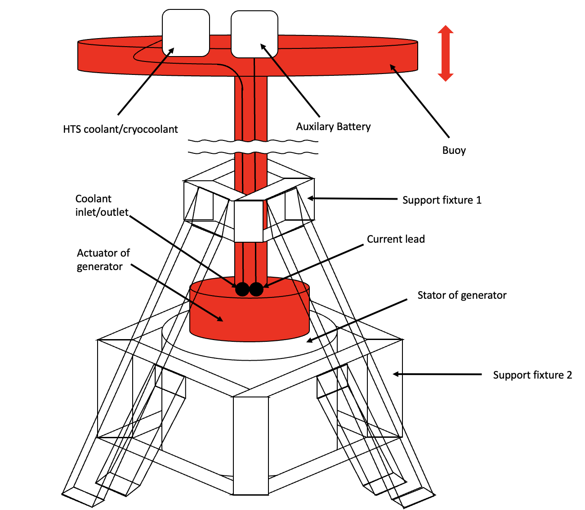
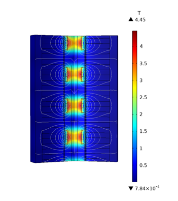

<b>Seoul, Korea</b> <i>Jun 2021 - Dec 2021</i>

  <b>Seoul, Korea</b> 
  <i>Jun 2021 - Dec 2021</i>  

  Wave energy is one of the most affluent renewable energy resources in the world and total energy worldwide has been increasing annually from 1948 to 2008. (1. B. G. Reguero et al., 2019) We proposed the conceptual design of a no-insulation (NI) HTS tubular wave energy converter (WEC) through sweeping magnet parameters and measuring output power. Thanks to the volume efficiency and high magnetic field generated by NI technology, the large output power can be achieved through the small size of WEC.

  The design is analyzed in the aspect of electromagnetism, mechanical force, and cryogen. Output power is measured by rectifying the circuit of the generator. Total harmonic distortion and power factor are also calculated for various conditions.

      <figure style="display: inline-block; width: 320px; margin: 10px; vertical-align: top;">
        
        <figcaption style="text-align: center; padding: 5px;">Figure 1: Conceptual Design of High-Temperature Superconductor (HTS) applied Wave Energy Converter (WEC) system.</figcaption>
      </figure>
      <figure style="display: inline-block; width: 320px; margin: 10px; vertical-align: top;">
        
        <figcaption style="text-align: center; padding: 5px;">Figure 2: Distribution of magnetic field in the generator.</figcaption>
      </figure>

    

